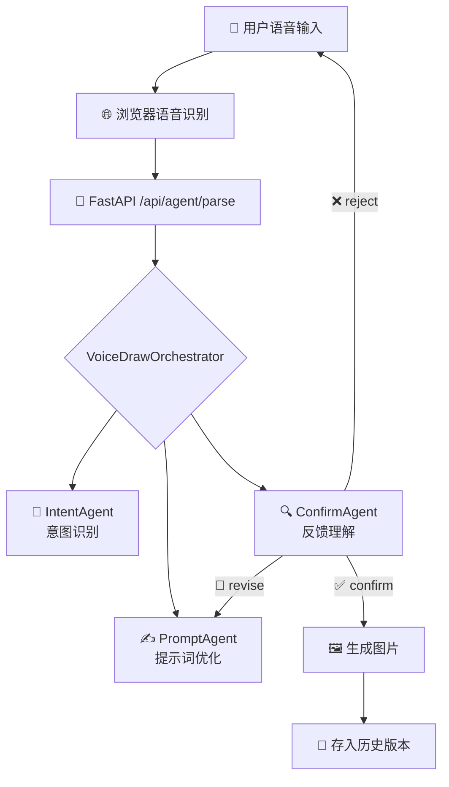

<div align="center">


<br/>


</div>

---

# 🎙️ VoiceDraw Agent

> 一款纯语音控制的 AI 绘图工具 —— 无需鼠标键盘，用声音完成从创意到图像的完整创作流程。

VoiceDraw Agent 是一款面向"纯语音控制绘图工具"课题的 AI 绘图 Demo。用户通过语音描述绘图需求，系统进行 **指令理解 → 提示词优化 → 用户确认 → 图像生成**，并支持基于已有图片的语音修改、历史版本管理和图片下载。

---

## 🎬 演示视频

<div align="center">
  <video src="https://github.com/user-attachments/assets/演示视频.mp4" width="80%" controls></video>
</div>

---

## ✨ 项目特点

| 特点 | 说明 |
|------|------|
| 🎤 **纯语音驱动** | 使用浏览器 Web Speech API 进行中文语音识别，全流程语音操作 |
| 🤖 **CrewAI 多智能体架构** | IntentAgent / PromptAgent / ConfirmAgent 三智能体协同工作 |
| ⚡ **FastAPI 后端服务** | 高性能异步后端，提供语音解析、图片生成、图片编辑等 API |
| 🎨 **React 前端界面** | Glassmorphism 科技风格 UI，对话区 + 图片展示区 + 历史版本区 |
| 🖼️ **图像生成与编辑** | 适配 DashScope `qwen-image` 系列，支持文生图 & 图像编辑 |
| ✅ **多轮确认机制** | 生成前展示优化提示词，用户可语音补充修改，确认后再生图 |
| 📜 **历史版本管理** | 支持点击放大、下载、语音回退到历史版本 |

### 三个 CrewAI 智能体

- **IntentAgent** 🧠 —— 识别用户语音指令意图（新图生成 / 图片修改 / 重新生成 / 回退 / 清空）
- **PromptAgent** ✍️ —— 将自然语言绘图需求优化为高质量绘图提示词
- **ConfirmAgent** 🔍 —— 理解用户对提示词的确认、补充、修改或拒绝意图

---

## 🛠️ 技术栈

### 前端

<p>
  
  
  
  
</p>

### 后端

<p>
  
  
  
  
  
  
  
  
</p>

### 模型服务

<p>
  
  
</p>

---

## 📁 目录结构

```text
VoiceDraw-Agent/
├── backend/
│   ├── agents/
│   │   ├── __init__.py
│   │   ├── intent_agent.py      # 🧠 CrewAI 意图识别智能体
│   │   ├── prompt_agent.py      # ✍️  CrewAI 提示词优化智能体
│   │   └── confirm_agent.py     # 🔍 CrewAI 用户反馈理解智能体
│   ├── .env.example             # 环境变量示例
│   ├── orchestrator.py          # 🎯 VoiceDrawOrchestrator，流程编排与智能体调度
│   ├── config.py                # ⚙️  配置加载 & CrewAI 存储路径
│   ├── image_gen.py             # 🖼️  图像生成 & 图像编辑服务
│   ├── main.py                  # 🚀 FastAPI 应用入口
│   └── requirements.txt         # 后端依赖
├── frontend/
│   ├── src/
│   │   ├── App.jsx              # 🎨 前端主逻辑
│   │   ├── App.css              # 💅 前端样式 (Glassmorphism)
│   │   └── main.jsx             # React 入口
│   ├── index.html
│   ├── package.json
│   └── vite.config.js
├── .gitignore
└── README.md
```

---

## 🔄 核心流程

<div align="center">



</div>

---

## 🎯 支持的语音能力

| 能力 | 示例语音指令 |
|------|-------------|
| 🖼️ 创建新图片 | "画一只穿宇航服的猫" |
| ✅ 确认生成 | "可以生成" / "就用这个" |
| 📝 补充修改提示词 | "可以，但是加一个月球背景" |
| ✏️ 基于当前图修改 | "把背景改成夜晚" / "给它加一顶蓝色帽子" |
| 🔄 重新生成 | "重新生成一张" |
| ⏪ 回退版本 | "回到上一个版本" |
| 🧹 清空画面 | "清空画面" |

---

## 🚀 本地运行

### 1️⃣ 克隆项目

```bash
git clone https://github.com/caigood/smart-voice-draw-Agent.git
cd VoiceDraw-Agent
```

### 2️⃣ 配置后端

```bash
cd backend
python -m venv .venv

# Windows
.venv\Scripts\activate

# macOS / Linux
source .venv/bin/activate

pip install -r requirements.txt
copy .env.example .env   # Windows
cp .env.example .env     # macOS / Linux
```

编辑 `backend/.env`：

```env
LLM_API_KEY=your_llm_api_key
LLM_BASE_URL=https://your-llm-compatible-endpoint/v1
LLM_MODEL=your-chat-model

IMAGE_API_KEY=your_image_api_key
IMAGE_BASE_URL=https://dashscope.aliyuncs.com/api/v1
IMAGE_MODEL=qwen-image
```

启动后端：

```bash
python main.py
```

> 默认运行在 `http://localhost:8000`，API 文档 `http://localhost:8000/docs`

### 3️⃣ 启动前端

```bash
cd frontend
npm install
npm run dev
```

> 默认运行在 `http://localhost:5173`

---

## 🔧 环境变量

| 变量 | 说明 | 示例 |
|------|------|------|
| `LLM_API_KEY` | 文本大模型 API Key | `sk-xxx` |
| `LLM_BASE_URL` | 文本大模型 Base URL | `https://api.openai.com/v1` |
| `LLM_MODEL` | 文本大模型名称 | `gpt-4o` |
| `IMAGE_API_KEY` | 生图模型 API Key | `sk-xxx` |
| `IMAGE_BASE_URL` | 生图模型 Base URL | `https://dashscope.aliyuncs.com/api/v1` |
| `IMAGE_MODEL` | 生图模型名称 | `qwen-image` |

---

## 💡 设计取舍

- **主动语音输入**：为避免持续监听导致误触发和隐私问题，系统采用点击麦克风按钮启动单轮语音输入的方式。
- **提示词确认机制**：为提升生成结果准确性，系统会在生成前展示优化提示词并等待用户确认/补充。
- **图像编辑局限**：二次编辑依赖模型能力，当前通过提示词强调"保持主体不变，仅修改指定部分"，但模型仍可能对未指定区域产生变化。
- **CrewAI 扩展性**：三智能体架构清晰，便于后续扩展更多 Agent（安全审查 / 成本控制 / 风格推荐等）。

---

## ⚠️ 注意事项

- 不要提交 `.env`、`.crewai`、`node_modules`、`dist` 等本地生成文件
- 浏览器首次使用语音识别需要麦克风权限授权
- 图像编辑能力依赖具体模型，非 `qwen-image` 系列可能不支持图片编辑

---

<div align="center">
  <sub>Built with ❤️ using CrewAI · FastAPI · React</sub>
</div>
